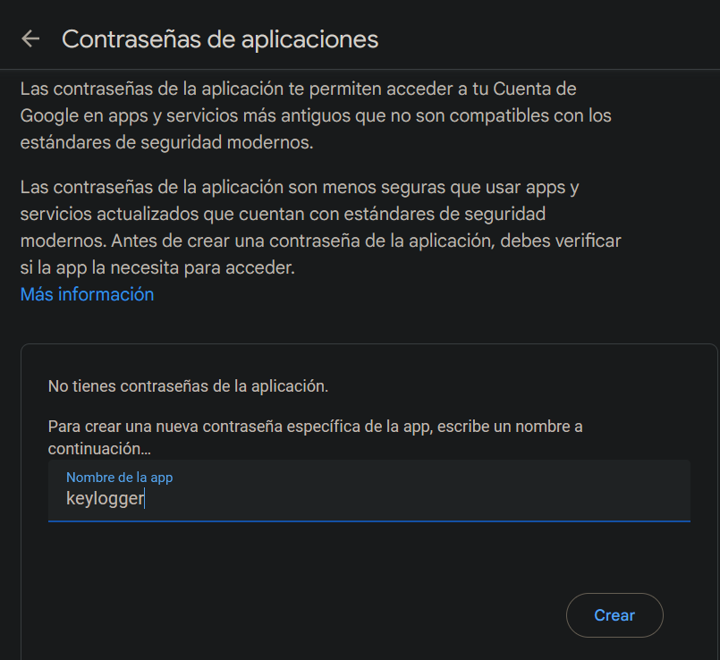

# keylogger

<p align="center">
    
</p>

**keylogger** is a tool that captures all keystrokes from a target device and sends them via email. You can use it by providing the **sender** and **password** arguments to specify who is sending the email, and the **recipients** argument to specify who will receive the captured keystrokes.

<p align="center">
    
</p>

## Table of contents

- [First stepts](#what-do-i-need-to-run-it)
- [Neccesarry steps before running](#how-does-it-work)
- [How to run it](#how-do-i-use-it)

## What do I need to run it?

1. First, clone the repository:

    ```git
    git clone https://github.com/sammy-ulfh/keylogger.git
    ```

2. Then, navigate to the **keylogger/script** directory.

3. Next, install required libraries using pip:

    ```pip3
    pip3 install -r requirements.txt
    ```
3. Finally, create an application on your gmail account (**its neccesarry two factor authentication**):

    When you have activated Two-Factor Authentication, navigate to __[AppPasswords](https://security.google.com/settings/security/apppasswords)__ on your Gmail account and create a new application password:<br/>

    <p align="center">
        
    </p>

    Then, you will obtain the application password, which allows the script to send emails:<br/>
    
    <p align="center">
        
    </p>

## How does it work?

This **keylogger** tool captures all keystrokes from a target device and sends them via email.

You can run the keylogger as a secondary process:<br/>

<p align="center">
    
</p>

Finally, every thirty seconds, you will receive the captured keystrokes:<br/>

<p align="center">
    
</p>

## How do I use it?

- **Sender:**
    Provide a sender email using the **-s / --sender** argument.<br/>
    Example: -s senderemail@gmail.com<br/>

- **Password:**
    Provide your apllication password from Gmail using the **-p / --password** argument.<br/>
    Example: -p "sdjc fimw sldjw"

- **Recipients:**
    Provide a recipient or recipients list emails separated by a comma using the **-r / --recipients** argument.<br/>
    Example: -r "recipienmail@gmail.com"
    Example: -r "recipienmail@gmail.com,senderemail@gmail.com"

